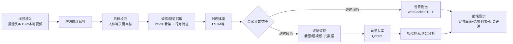

# SmartSansan — 异常行为检测智能监控系统

SmartSansan（AIWatchdog）是一个面向真实监控场景的**实时异常行为检测系统**：从摄像头/视频流接入开始，完成目标检测、行为理解、异常告警、事件留存与检索，并提供 Web 控制台进行实时查看与历史追溯。

---

## 项目做什么

传统监控“看见”不等于“看懂”。本项目的目标是让系统能自动完成：

- 从视频流中实时识别关键目标（以“人”为核心）
- 基于姿态/时序信息对行为进行建模，输出异常分数 / 异常类型
- 异常触发后自动告警推送并归档证据
- 通过向量数据库对历史告警进行相似事件检索
- （可选）接入大模型 + RAG 做语义检索 / 解释 / 摘要

适用于：校园 / 园区 / 仓储 / 养老看护等需要“自动巡检 + 事后追溯”的场景。

---

## 核心能力

- **实时视频分析**：支持摄像头 / RTSP / 本地视频输入，实时推理并输出叠加结果
- **异常行为识别**：基于时序模型（如 LSTM）对连续帧特征做异常判定
- **告警推送**：通过 WebSocket / HTTP 等方式向前端或业务端推送告警事件
- **事件留存**：告警截图 / 短视频片段 + 元数据（时间、来源、类型、置信度等）自动归档
- **向量检索**：告警事件特征向量写入 Qdrant，支持相似告警查询与追溯
- **Web 控制台**：实时画面、告警列表、历史查询、告警详情查看

---

## 总体流程

1. **视频接入**：摄像头 / RTSP / 本地视频 -> 解码为连续帧  
2. **目标检测**：检测人体等关键目标 -> 输出 bbox / 置信度 / 类别  
3. **姿态/特征提取**：人体关键点（2D/3D 骨架）与行为特征构建  
4. **时序建模**：将特征序列输入时序模型（如 LSTM）-> 输出异常分数 / 行为类型  
5. **告警与归档**：超过阈值 -> 推送告警 -> 保存证据与元数据  
6. **向量入库**：告警特征向量写入 Qdrant -> 支持相似检索与聚合分析  
7. **前端展示**：实时视频 + 告警列表 + 历史检索与详情回放  

可选流程图：



---

## 模块说明

### 1) Video Stream（视频流接入）
- 接入摄像头 / RTSP / 本地视频
- 负责解码、帧率控制、基础预处理（缩放 / 裁剪等）

### 2) Detection（目标检测）
- 对每帧进行目标检测（重点为人体）
- 输出检测框、置信度、类别等信息，为后续姿态与行为分析提供 ROI

### 3) Pose / Skeleton（姿态估计与骨架建模）
- 对人体区域进行关键点提取（2D / 3D）
- 生成骨架序列特征，提高对动作/姿态变化的表达能力与鲁棒性

### 4) Temporal Action / Anomaly（时序行为与异常判定）
- 将连续帧特征序列输入时序模型（如 LSTM）
- 输出行为类别 / 异常分数，并结合阈值/规则进行最终异常触发判定

### 5) Alert（告警与通知）
- 告警触发策略：阈值、冷却时间、防抖、合并同类事件等
- 推送方式：WebSocket 实时推送（可扩展 HTTP 回调 / 消息系统等）

### 6) Archive（事件归档与证据留存）
- 保存告警截图 / 短视频片段
- 记录事件元数据：时间、来源摄像头、告警类型、置信度、目标信息等

### 7) Vector Store（向量库与相似检索）
- 将告警事件特征向量写入 Qdrant
- 支持相似事件检索、历史事件聚合与分析（如按类型 / 时间段检索）

### 8) RAG / LLM（可选：语义检索与解释）
- 在向量检索基础上接入大模型
- 支持对历史告警进行语义查询、归因解释、自动摘要（用于分析与汇报场景）

### 9) Web Console（前端控制台）
- 实时画面展示：叠加检测框 / 骨架 / 告警标签
- 告警列表：筛选、搜索、查看详情
- 历史追溯：按时间 / 类型查询，查看证据与相似事件推荐

---

## 技术栈

- **后端**：FastAPI / Uvicorn（WebSocket 实时推送）
- **视觉推理**：目标检测（YOLO 系列）+ 姿态估计（骨架/关键点）+ 时序模型（如 LSTM）
- **向量数据库**：Qdrant（告警事件向量化检索）
- **前端**：Web 控制台（React 或原生页面）
- **工程化**：配置管理、日志、可扩展的模块化推理管线

---

## 快速开始

> 以下为“能跑起来”的最小示例流程；模型文件、视频源等请按你的实际工程配置替换。

### 1) 启动 Qdrant（Docker）
```bash
docker run -d \
  --name qdrant \
  -p 6333:6333 \
  -p 6334:6334 \
  qdrant/qdrant
```

### 2) 安装依赖
```bash
pip install -r requirements.txt
```

### 3) 启动后端服务（示例）
```bash
uvicorn video_server:app --host 0.0.0.0 --port 16532 --reload
```

### 4) 打开前端控制台
- **静态页面**：直接打开 `index.html`
- **React 项目**：
```bash
npm install
npm run dev
```

---

## 配置项（建议）

建议使用 `.env` 或独立配置文件集中管理（示例字段如下）：

- `VIDEO_SOURCE`：摄像头编号 / RTSP 地址 / 本地视频路径
- `QDRANT_HOST`：如 `http://localhost:6333`
- `MODEL_DET_PATH`：检测模型路径
- `MODEL_SEQ_PATH`：时序模型路径
- `ALERT_THRESHOLD`：异常阈值
- `SAVE_DIR`：告警证据保存目录

示例 `.env`（按需增删）：

```dotenv
VIDEO_SOURCE=rtsp://user:pass@ip:port/stream
QDRANT_HOST=http://localhost:6333
MODEL_DET_PATH=./weights/detector.pt
MODEL_SEQ_PATH=./weights/lstm.pth
ALERT_THRESHOLD=0.80
SAVE_DIR=./video_warning
```
